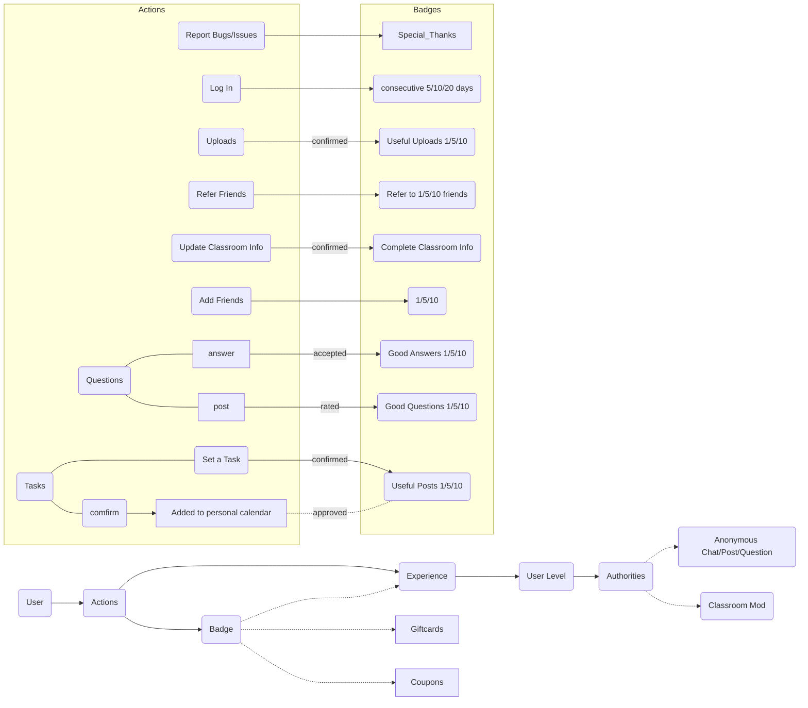

# Level and Badge System

```mermaid
graph LR;
  u(User);
  l(User Level);
  x(Experience);
  a(Authorities);
  b(Badge);

  act(Actions)

  u --> act
  act --> x
  act --> b

  l --> a;

  b -.-> x
  b -.-> Giftcards;
  b -.-> Coupons;
  x --> l;
  a -.-> z2(Anonymous Chat/Post/Question);
  a -.-> z3(Classroom Mod);

  subgraph Actions
    rep(Report Bugs/Issues)
    log(Log In)
    up(Uploads)
    task(Tasks)
    ques(Questions)
    ref(Refer Friends)
    upd(Update Classroom Info)
    adc(Add Friends)

    task --- set(Set a Task)
    task --- add(comfirm)
    add --> added[Added to personal calendar]


    ques --- answer
    ques --- post

  end

  subgraph Badges
    adc --> adcs(1/5/10)
    upd -- confirmed --> cmpClass(Complete Classroom Info)
    up -- confirmed --> gus(Useful Uploads 1/5/10)
    added -. approved .- gps
    set -- confirmed --> gps(Useful Posts 1/5/10)
    log --> days(consecutive 5/10/20 days)
    rep --> Special_Thanks
    answer -- accepted --> gas(Good Answers 1/5/10)
    post -- rated --> gqs(Good Questions 1/5/10)
    ref --> refs(Refer to 1/5/10 friends)
  end
```
